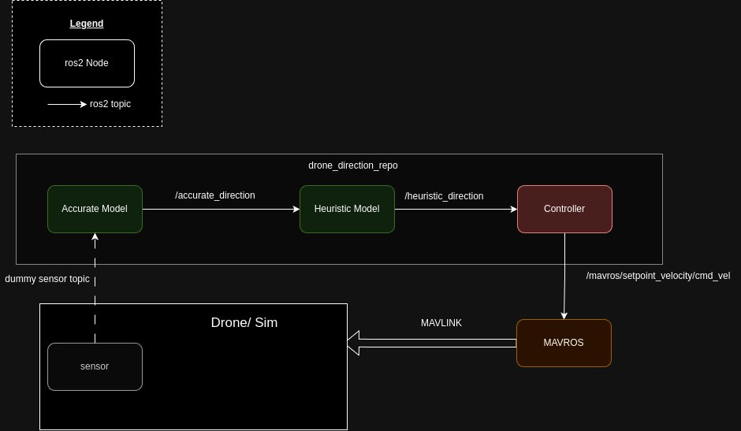

# Drone Direction ROS2 Package

This ROS2 package is designed to control the direction of a drone using AI models. The package includes nodes for generating accurate directions, applying heuristic models, and controlling the drone based on the model outputs.  all with stub logic.

## Overview

The package consists of the following components:
- **Accurate Model Node**: Generates accurate direction data (from sensor data).
- **Heuristic Model Node**: Applies heuristic adjustments to the direction data.
- **Controller Node**: Sends control commands to the drone using MAVROS based on the heuristic direction.



## Installation and Setup

### Prerequisites

- ROS2 Humble (or compatible version)


### Building the Package

1. Clone the repository into your ROS2 workspace:

    ```bash
    cd ~/your_ros2_ws/src
    git clone https://github.com/eladpar/drone_direction.git
    ```
2. Navigate to the root of your workspace and build the package:

    ```bash
    cd ~/your_ros2_ws
    colcon build --symlink-install
    ```
3. Source the workspace:

    ```bash
    source install/setup.bash

    ```

### Running the Nodes

You can launch all the nodes using the provided launch file:

```bash
ros2 launch drone_direction direction_drone_launch.py
```
## Parameters

The package uses a `params.yaml` file located in the `config` directory to configure various settings for the nodes. Here's a list of the parameters:

- **accurate_model**:
  - `direction_min`: Sets the minimum value for the direction data.
  - `direction_max`: Sets the maximum value for the direction data.
  - `publish_frequency`: The rate at which the direction data is published, in HZ.

- **heuristic_model**:
  - `heuristic_multiplier`: A factor that modifies the accurate direction data.
  - `publish_frequency`: The rate at which the heuristic direction data is published, in HZ.

- **controller**:
  - `cmd_topic`: The ROS2 topic for publishing velocity commands.
  - `linear_velocity`: The speed at which the drone moves.
  - `angular_speed_factor`: A factor that determines how the drone turns based on the direction data.

To modify these parameters, you can edit the `params.yaml` file and then rebuild the package.


## Package Structure

The package is structured as follows:
```sh
.
├── accurate_model
│   ├── accurate_model.py
│   └── __init__.py
├── CMakeLists.txt
├── config
│   └── params.yaml
├── controller
│   ├── controller_node.py
│   └── __init__.py
├── diagrams
│   └── ros2_drone_direction_diagram.png
├── drone_direction
│   └── __init__.py
├── heuristic_model
│   ├── heuristic_model.py
│   └── __init__.py
├── launch
│   └── direction_drone_launch.py
├── package.xml
└── setup.py


```